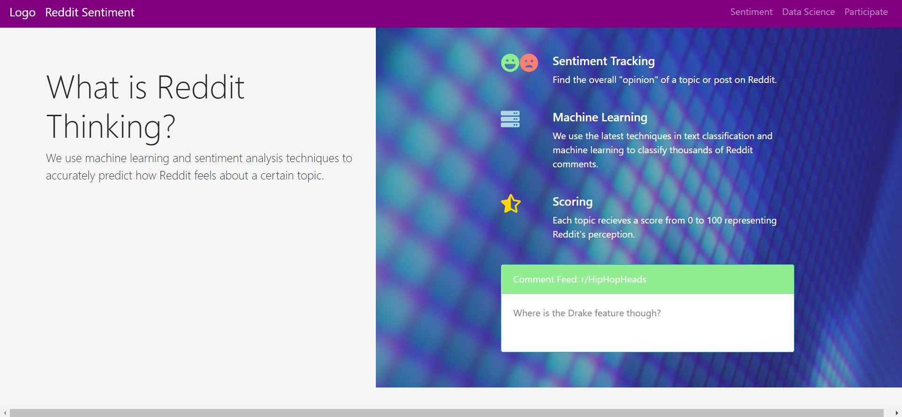
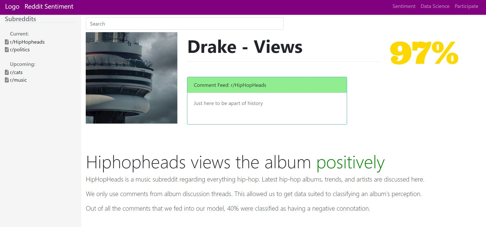

# Reddit Sentiment Project

This is a machine learning project designed to take Reddit comments, classify them based off sentiment, and provide an overall "score" to Reddit topics (albums currently).

The learning model is wrapped in a web application designed to give the user a pleasant UI when traversing through different Reddit topics.

The technologies/tools used in this project are React, Flask, mySQL TensorFlow, Keras, the Reddit API PRAW, and Python.

## Code

The React application code can be located in react_application/reddit-sentiment/.

The Flask application code can be located in flask_application/flask_server/.

The machine learning code and the models can be located in tensorflow_kerasML/.

## Example Images

## Still To Do

1. Continue to build out Flask backend to add different functionalities
2. Continue to connect Flask backend with React frontend through REST
3. Update React UI to be more appealing

## Contact

alexander.c.dougherty@vanderbilt.edu
